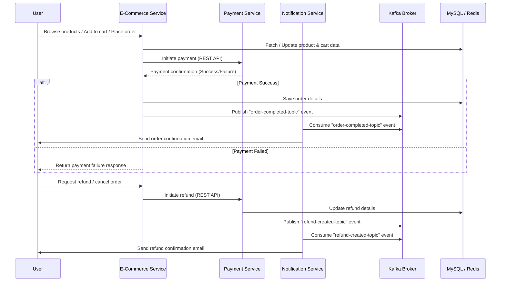

## 🧠 Overview

The **E-Commerce Service** is responsible for:
- Managing the product catalog
- Handling cart operations (add/update/remove items)
- Processing order creation and management
- Producing **Kafka events** to notify other services (e.g., Notification Service) when an order is completed

It acts as the central hub of the e-commerce ecosystem.

---

## 🧩 Architecture

This project follows a **microservices architecture**.

| Service | Description |
|----------|--------------|
| **E-Commerce Service** | Core service managing Product, Cart, and Order modules |
| **User Service** | Manages customer profiles, authentication, and account details |
| **Payment Service** | Handles payment initiation, verification, and refund workflows via Razorpay |
| **Notification Service** | Sends emails to customers based on Kafka events (e.g., order completion) |

---

### 🏗️ E-Commerce Microservice Architecture (Detailed)

```mermaid
flowchart LR
    subgraph EComService[E-Commerce Service]
        A[Product Module]
        B[Cart Module]
        C[Order Module]
    end

    U[User Service]
    P[Payment Service]
    N[Notification Service]

    DB[(MySQL Database)]
    K[(Kafka Broker)]
    R[(Redis Cache)]

    A --> DB
    B --> DB
    C --> DB
    C -->|Publish "order-completed-topic"| K
    N -->|Consume "order-completed-topic"| K
    P --> EComService
    U --> EComService
    EComService --> R
```
## ⚙️ Tech Stack

- **Language:** Java 17
- **Framework:** Spring Boot 3
- **Database:** MySQL
- **Message Broker:** Apache Kafka
- **Cache:** Redis
- **Containerization:** Docker
- **Build Tool:** Maven

### External Dependencies (via other microservices)
- **Payment Service** → integrates with **Razorpay** for payment processing
- **Notification Service** → integrates with **SMTP** for email delivery

## 📂 Module Overview

### 🧱 Product Module
- Manages the **product catalog** including product name, description, price, stock quantity, and category.
- Provides **CRUD (Create, Read, Update, Delete)** APIs for product management.
- Validates product data before persistence.
- Interacts with the **MySQL database** for data storage.
- Plays a central role in product listing and inventory management.
- Uses **Redis** for fast retrieval and low-latency operations.

---

### 🛍️ Cart Module
- Handles all operations related to the **shopping cart**.
- Supports:
    - Adding items to the cart
    - Updating item quantity
    - Removing items from the cart
    - Viewing cart details
- Calculates **total price** dynamically based on cart contents.
- Ensures data consistency between product availability and cart state.

---

### 📦 Order Module
- Manages the **order lifecycle** from creation to completion.
- Responsible for:
    - Order creation and validation
    - Payment initiation via the **Payment Service** (REST call)
    - Persisting order details to **MySQL**
    - Updating order status based on payment success/failure
- Publishes **Kafka event (`order-completed-topic`)** after a successful order completion.
- Publishes **Kafka event (`refund-created-topic`)** after a successful refund initiatio.
- This event is consumed by the **Notification Service** to trigger order confirmation emails.

---

### 🧩 Inter-Module Relationships
- The **Product Module** provides product details used by the **Cart** and **Order** modules.
- The **Cart Module** aggregates user-selected products before an order is created.
- The **Order Module** finalizes transactions and communicates with external services (Payment & Notification).

---

## 🕸️ Inter-Service Communication Overview

The E-commerce platform follows a **microservices architecture**, where each service handles a specific domain responsibility and communicates using **REST APIs** and **Kafka events**.  
This ensures **loose coupling**, **scalability**, and **resilience** across services.

---

### 🔄 Inter-Service Communication Flow



